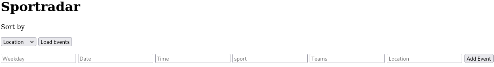

<h1 align="center">Welcome to SportCalendar 👋</h1>
<p>
  
</p>

> A website which hosts a calendar with fictional sport events, pulled by a server.

## Prerquisites

* Node >= v.16.13.2
* Linux OS 

## Usage

* Running the server

```
node server.js
```
> To run the client the index.html file must be executed.

<p align="center">
  
</p>

As soon as the client is connected to the server the sport events can be displayed by clicking on the 'Load Events' - button. Whenever the user wants to sort the events by any column he can use the dropdown menu next to the button.

## Author

👤 **Botan Celik**

* Website: https://thebloodyamateur.github.io/
* Github: [@TheBloodyAmateur](https://github.com/TheBloodyAmateur)
* LinkedIn: [@https:\/\/www.linkedin.com\/in\/botan-celik-313a1a1bb\/](https://linkedin.com/in/https:\/\/www.linkedin.com\/in\/botan-celik-313a1a1bb\/)

## Show your support

Give a ⭐️ if this project helped you!

***
_This README was generated with ❤️ by [readme-md-generator](https://github.com/kefranabg/readme-md-generator)_
